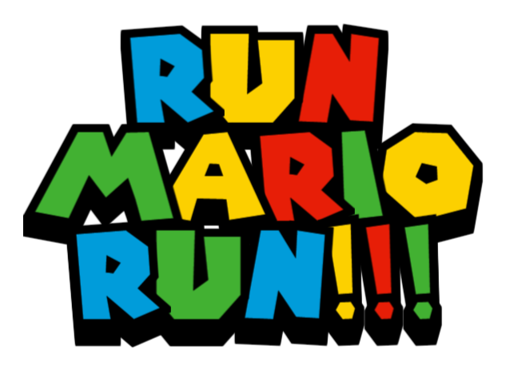

# Run Mario Run

Welcome to **Run Mario Run**, a professionally crafted game developed using the C# MonoGame framework. Join Mario in his perpetual run, skillfully navigating obstacles and evading pipes. Master the art of timing to ensure Mario's safety and achieve remarkable high scores!

## Table of Contents
- [Gameplay](#gameplay)
- [Key Features](#key-features)
- [Screenshots](#screenshots)
- [Installation](#installation)
- [Controls](#controls)
- [Scenes](#scenes)
- [Exiting the Game](#exiting-the-game)

## Gameplay

Embark on an endless journey with Mario, overcoming obstacles and avoiding pipes. Mario runs automatically, and your precise input is crucial for navigating through challenges. Click the left mouse button or press the space bar to make Mario jump and conquer the course.

## Key Features

- **Seamless Endless Running:** Experience an infinite and challenging runner game.
- **Personalized Player Experience:** Input your name for a customized gaming session.
- **Intuitive Help Scene:** Access clear and concise instructions for seamless gameplay.
- **Insightful About Scene:** Learn more about the skilled developers behind this project.

## Screenshots

*Home page screenshot*

*Play page screenshot 2*

*game over page screenshot 2*

## Installation

1. Clone the repository: `git clone https://github.com/mahir1522/run-mario-run.git`
2. Open the project in your preferred C# IDE.
3. Build and run the project.

## Controls

- **Responsive Jump Mechanism:** Click the left mouse button or press the space bar for timely jumps.

## Scenes

- **Main Menu:** Begin your personalized gaming experience by entering your name.
- **Help Scene:** Find comprehensive instructions for smooth gameplay.
- **About Scene:** Discover the skilled minds behind the development.

## Exiting the Game

- Press the `Esc` key at any point to gracefully exit the game.
- Utilize the back button to seamlessly return to the main menu.

---

Feel free to tailor this template further to align with your project's professional tone and style. Good luck with your game development endeavors! 🎮🏃‍♂️🍄

